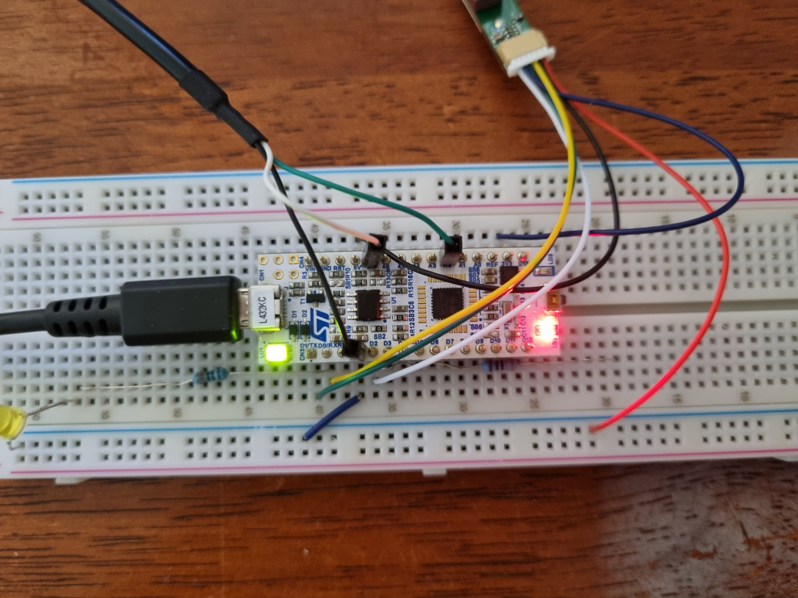

# Listen to GP-735T
Listen to a GP-735T GPS module. Also receive user input on USART2 RX to turn on/off the GPS.

#### MCU
_STM32L432KC_

#### Development Board
_Nucleo-L432KC_

## Pin Connection Diagram

## Wiring

